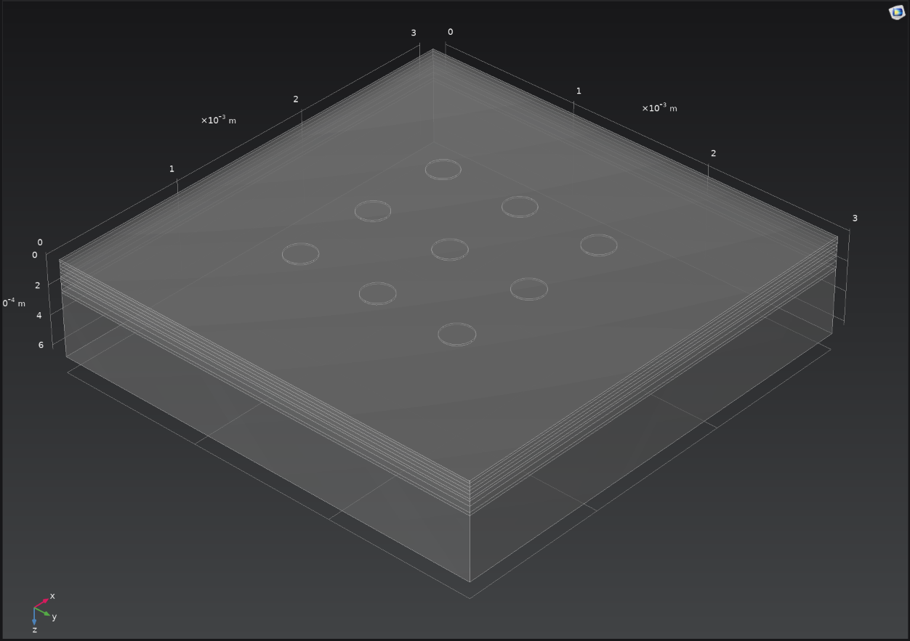
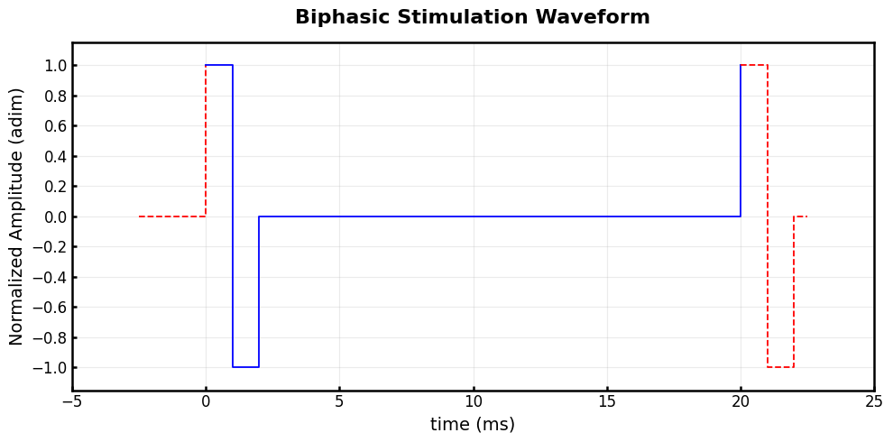
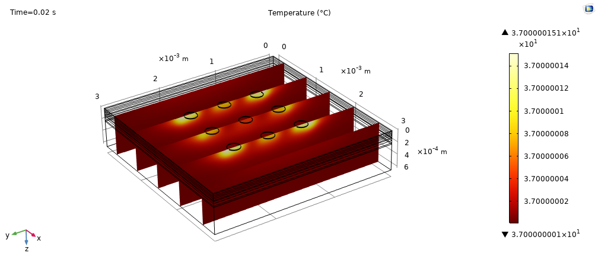
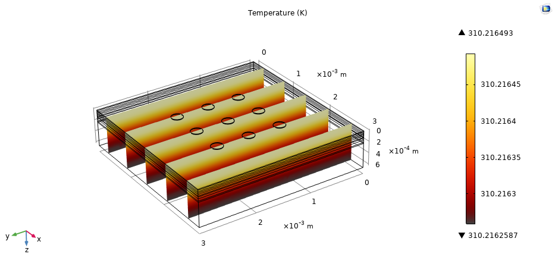
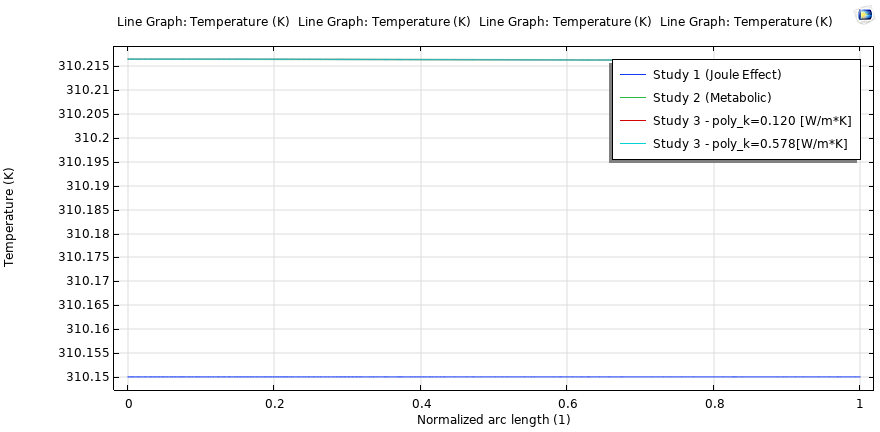
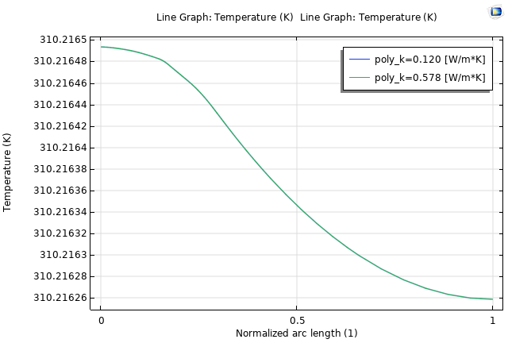

# Thermal Safety Analysis of Epiretinal Stimulation
### Joule Heating versus Natural Retinal Metabolism

## 📌 Project Overview
This repository contains the finite element (FE) simulation and technical documentation for a university project analyzing the thermal safety of epiretinal prostheses (inspired by the **Argus II** system). 

Electrical stimulation of neural tissues generates **Joule heating** at the electrode-tissue interface. According to ISO 14708 standards, active implantable devices must not elevate tissue temperature by more than 1–2 °C. However, standard analyses often ignore a critical factor: the **natural metabolic heat** produced by the retina itself (one of the most metabolically active tissues in the human body).

This project uses **COMSOL Multiphysics** to directly compare the Joule heat generated by a biphasic stimulation pulse against the physiological metabolic thermal baseline of the retinal layers.

## 🧬 Methodology & Physics
The model couples two main physics interfaces:
1. **Electric Currents (Quasi-Static):** Solves the Volume Conductor equation for a 3x3 array of 200 µm platinum electrodes.
2. **Heat Transfer in Solids (Pennes Bioheat Equation):** Extends standard heat diffusion with:
   - *Blood Perfusion:* Applied to the choroid acting as a heat sink.
   - *Metabolic Heat Generation:* Volumetric heat ($W/m^3$) derived from *in-vivo* oxygen consumption literature (Braun & Linsenmeier, Yu & Cringle, Birol).

  
  

## 📊 Key Findings

The results overwhelmingly demonstrate the thermal safety of the device at a standard $20\ \mu A$ stimulation amplitude:

- **Joule Heating:** Highly localized at the electrode edges due to the divergence of current density, but with a maximum amplitude of just **~8.88 µK**.
  

- **Metabolic Baseline:** Generates a broad thermal elevation of **~66 mK**, peaking at the photoreceptor layer (Outer Nuclear Layer).
  

- **Comparison:** The Joule heating represents just **0.013%** of the natural metabolic baseline. The electrical thermal contribution is entirely masked by normal cellular activity.
  

- **Polyimide Effect:** The theoretical thermal barrier effect of the polyimide substrate is negligible (~1 µK difference), further validating safety.
  

## 🎥 Thermal Propagation Animations

The following time-dependent animations (20 ms simulation) showcase the heat propagation in the retinal tissue.

  <table>
    <tr>
      <td align="center"><b>3D Temp. Distribution (Combined)</b> </td>
      <td align="center"><b>3D Temp. Distribution (Joule)</b> </td>
    </tr>
    <tr>
      <td align="center"><b>Volumetric Heat Dispersion (Combined)</b> </td>
      <td align="center"><b>Volumetric Heat Dispersion (Joule)</b> </td>
    </tr>
  </table>

## 📂 Repository Structure

*   `docs/`: Contains the detailed English [METHODOLOGY.md](docs/METHODOLOGY.md) (translating the technical presentation speech), the HTML comprehensive report, and the Presentation PDF.
*   `model/`: Contains the cleared COMSOL Multiphysics project (`.mph`). *Note: Meshes and solutions have been cleared to reduce file size. To view the results, simply open the file in COMSOL and click 'Compute' on the desired study.*
*   `media/`: Contains all presentation images, charts, and GIF animations of the heat propagation.

## 🚀 How to use
1. Read the `docs/METHODOLOGY.md` to understand the theoretical background, the boundary conditions, and the setup.
2. Open `model/COMSOL_Project/Epiretinal_Heat_Stimulation.mph` in COMSOL 6.4+.
3. Run the **Joule Only**, **Metabolic Only**, or **Combined** studies to regenerate the temperature profiles.

---
*Project for the course "Modelling of Multi-Physics Phenomena" - A.Y. 2025-2026*
